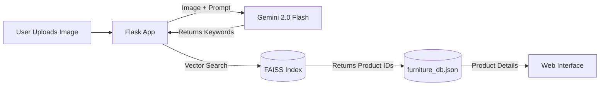

# Wayfair Intelligent Design Recommendation System (MVP)

## Project Overview
This is a prototype smart home recommendation system based on Python and the Google Gemini 2.0 Flash model.
**Goal**: Analyze a user-uploaded room photo to identify room style and missing elements, then automatically recommend the most suitable furniture items from a mock Wayfair inventory.

---

## Key Features

1.  **Visual Intelligence**
    - Uses the `google-generativeai` library to call the Gemini model.
    - **Prompt**: Acts as an interior design expert to analyze room style (e.g., Scandi, Industrial) and suggest specific items.
    - Output: Precise English product keywords (e.g., `large abstract art`).

2.  **Smart Matching Logic**
    - **Semantic Search**: Implemented using `sentence-transformers` and FAISS for vector-based semantic matching.
    - **NLP Enhancement**: Handles category mapping (e.g., "artwork" -> "Wall Art") and keyword tokenization.

3.  **Mock Infrastructure**
    - Automatically generates 20 realistic furniture items with distinct styles, prices, and descriptions (`furniture_db.json`).
    - Uses `loremflickr` to provide dynamic, realistic product images.
    - Mobile Access: Includes a QR code feature for testing on mobile devices via local network.

---

## Architecture



## File Structure

| Filename | Description |
| :--- | :--- |
| `app.py` | **Backend API**. Handles file uploads, Gemini integration, and vector search logic. |
| `data_generator.py` | **Data Tool**. Generates `furniture_db.json` and `furniture_vectors.index` for testing. |
| `furniture_db.json` | **Database**. JSON file storing product ID, name, category, style, price, and image URL. |
| `index.html` | **Frontend**. Responsive web interface mimicking Wayfair App (Tailwind CSS). |
| `main.py` | **Legacy CLI**. Command-line version of the tool (kept for reference). |

---

## Request for Feedback

This project is currently in the MVP stage. I would appreciate feedback on:

1.  **Matching Algorithm Optimization**
    - Currently using FAISS + Sentence Transformers. Is there a more efficient way for larger datasets?
    - How to better handle multi-modal retrieval (Text + Image matching)?

2.  **Prompt Engineering**
    - How to further optimize the Gemini system prompt for more consistent JSON outputs?

3.  **Scalability**
    - Recommendations for migrating from JSON/FAISS-flat to a production-ready vector database (e.g., Pinecone, pgvector).

---

## How to Run

1.  **Install Dependencies**:
    ```bash
    pip install -r requirements.txt
    ```
2.  **Configure API**:
    Set your Google Gemini API Key in `app.py` or environment variables.
3.  **Generate Data**:
    ```bash
    python3 data_generator.py
    ```
4.  **Run Application**:
    ```bash
    # Terminal 1: Backend
    python3 app.py
    
    # Terminal 2: Frontend
    python3 -m http.server 8000
    ```
5.  **Access**:
    Open `http://localhost:8000` in your browser.
