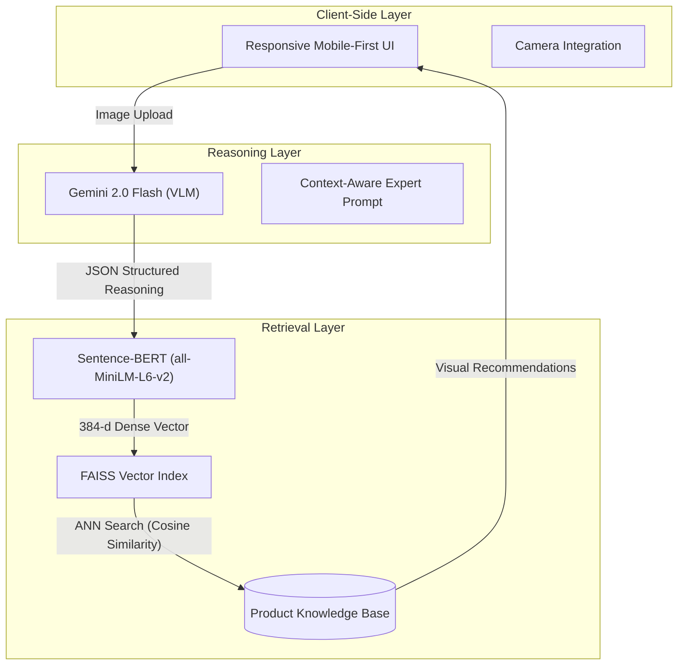

# VLM-Driven Intelligent Interior Design Recommendation System

> **Abstract**: This project presents a novel approach to e-commerce recommendation systems by bridging the semantic gap between unstructured visual inputs and structured product catalogs. By leveraging State-of-the-Art (SOTA) Visual-Language Models (VLMs) for scene understanding and high-dimensional vector embeddings for retrieval, we propose a system that translates user-uploaded room imagery into actionable, style-coherent furniture recommendations.

## 1. Introduction

Traditional interior design recommendation engines often rely on collaborative filtering or metadata-based keyword matching. These approaches suffer from the "cold start" problem and fail to capture the nuanced, stylistic coherence required in interior design.

This system introduces a **Multimodal Retrieval-Augmented Generation (RAG)** pipeline. It utilizes **Google Gemini 2.0 Flash** as a reasoning agent to deconstruct visual scenes into semantic descriptors, which are then mapped to a vector space for efficient nearest-neighbor search against a product inventory.

## 2. System Architecture

The architecture is designed as a decoupled, latency-optimized pipeline comprising three core modules: **Visual Reasoning**, **Semantic Retrieval**, and **Frontend Presentation**.



### 2.1 The Visual-Language Model (VLM) Agent
We employ **Gemini 2.0 Flash** not merely as a classifier, but as a **Zero-shot Reasoning Agent**.
*   **Input**: Raw pixel data (RGB images).
*   **Task**: "Interior Design Expert" role-play.
*   **Reasoning Chain**:
    1.  **Scene Decoding**: Identify architectural style (e.g., Mid-Century Modern, Industrial).
    2.  **Gap Analysis**: Detect missing functional or aesthetic elements (e.g., "Lack of ambient lighting").
    3.  **Semantic Translation**: Convert visual observations into search-optimized keywords (e.g., "Geometric brass floor lamp").

### 2.2 Semantic Vector Retrieval
To overcome the limitations of lexical search (keyword mismatch), we implement a **Dense Retrieval** mechanism.
*   **Embedding Model**: `all-MiniLM-L6-v2` (Sentence-Transformers). Maps textual descriptions to a 384-dimensional latent space.
*   **Indexing**: **Facebook AI Similarity Search (FAISS)** provides efficient similarity search. We utilize an `IndexFlatL2` structure for precise Euclidean distance calculations, ensuring recommendations are semantically close to the VLM's inference.

### 2.3 Mobile-First Interaction Design
The frontend replicates the native experience of industry-standard applications (e.g., Wayfair).
*   **Tech Stack**: Vanilla Architecture (HTML5/JS) + Tailwind CSS utility-first styling.
*   **Network Strategy**: Implements a dedicated mobile access tunnel via QR code binding to the local LAN IP (`0.0.0.0:5001`), bypassing standard localhost restrictions to enable real-world device testing.

## 3. Methodology & Implementation

### 3.1 Data Simulations
A synthetic dataset generation pipeline (`data_generator.py`) serves as the testbed. It constructs a mock inventory with:
*   **Style-Consistent Metadata**: Attributes like "Modern", "Rustic".
*   **Dynamic Visuals**: Integration with `loremflickr` to generate category-specific imagery.
*   **Vector Construction**: Pre-computes embeddings for all items during initialization to minimize runtime latency.

### 3.2 Backend Service
Powered by **Flask**, the backend serves as an orchestration layer. It handles:
*   **Multipart/form-data** processing for high-resolution image uploads.
*   **JSON Parsing Robustness**: Heuristic repair strategies for non-deterministic LLM outputs.
*   **Port Management**: Dynamic port binding (5001) to evade macOS AirPlay conflicts.

## 4. Future Research Directions

1.  **Multimodal Embeddings (CLIP/SigLIP)**: Migrating from Text-to-Vector to Image-to-Vector retrieval to allow direct visual similarity matching without textual intermediation.
2.  **Personalization Layer**: Introducing a persistent user store (PostgreSQL) to learn style preferences over time using Reinforcement Learning from Human Feedback (RLHF).
3.  **Production Infrastructure**: Containerization (Docker) and orchestration (Kubernetes) for horizontal scaling of the model inference layer.

---

## 5. Quick Start

### Prerequisites
*   Python 3.10+
*   Google Gemini API Key

### Installation

```bash
# 1. Clone the repository
git clone https://github.com/Daaaazy/VLM-based-interior-design-recommendation-system.git

# 2. Install dependencies
pip install -r requirements.txt

# 3. Initialize Data & Index
python3 data_generator.py

# 4. Launch System
# Terminal A (Backend)
python3 app.py
# Terminal B (Frontend)
python3 -m http.server 8000
```

---
*Author: Zang Yida*
*Date: January 2026*
